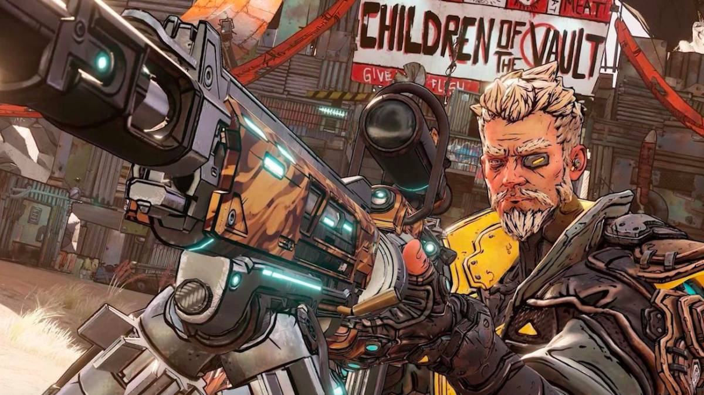
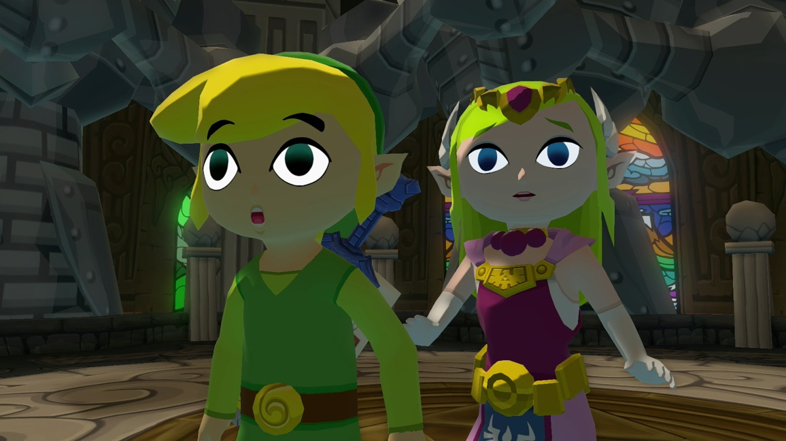

# Shady Balls : An introduction to shaders in Unity

## Table of Contents
- [Introduction](#Introduction)
    - [What are shaders](#What-are-shaders)
    - [What are materials](#What-are-materials)

## Introduction

### What are shaders
According to [wikipedia](https://en.wikipedia.org/wiki/Shader) shaders are
> a type of **computer program** originally used for shading in 3D scenes.

WOW that's way too wikipedia, but let's take the computer program part and start over.

Shaders are computer programs (or simply codes) that are meant to be run on graphics cards to do rendering calculations such as lighting, but hell, we are human and we can use it for whatever we want, such as:

- moving scenes
- water depth
- [wave effect](https://catlikecoding.com/unity/tutorials/flow/waves/)
- [weapon scope effect](https://www.reddit.com/r/Unity3D/comments/h7fnze/managed_to_implement_a_nice_dual_render_scope/)
- [interior mapping](http://christopher-harper.com/project/interior-mapping/)
- [force fields](https://www.youtube.com/watch?v=NiOGWZXBg4Y&ab_channel=Brackeys)
- [moving grass effects](https://roystan.net/articles/grass-shader.html)
- [booze](https://www.youtube.com/watch?v=8kQW2jFPYZo&ab_channel=2kliksphilip)
- [curvy roads](https://assetstore.unity.com/packages/vfx/shaders/curved-world-2020-173251)
- [heat distortion effect](https://lindenreid.wordpress.com/2018/03/05/heat-distortion-shader-tutorial/)

Graphics cards architecture has the power of parallel computations which makes it an ideal hardware to run graphics programs on, since every pixel needs to be rendered in each frame.
With parallel programming the graphic cards with their enough small "cores" can run shaders (single instruction) for each pixel (multiple data) to render an image very quick.

Shaders also are used to create different artstyle way more easier. For example games like Borderlands use shaders to give all the 3D objects some outline or "border" without using dedicated materials to this artstyle.

Borderlands Artstyle (Credit: IGN)

Another example is cel-shading that can be seen in cartoony and stylish games like The Legend of Zelda : Windwaker or Breath of the wild, with this technique lighting gradient can be discretized to make the shadows look cartoony.

The Legend of Zelda: Wind Waker Artstyle (Credit: zeldauniverse.net)

### What are materials

Like any other computer programs, shaders can have inputs, these inputs are simply the materials we always use in Unity. In Unity each material is connected to a shader and each material can have some properties that shader needs.

For example shaders can have these properties and each material which uses that shader should have a value for that property:

- Color
- Texture
- Normal map
- Glossiness
- Metalicness
- Scroll speed

Some complex shaders even use more advanced properties like IOR (index of refraction) for translucent objects.

So in general shaders use two types of data:

1. The **material** which is the properties or variables that they need.
2. The **position** of a pixel, this is the data that the shader knows for itself and it doesn't need to be feed into. This is the data that shaders knows on its' own.

So each pixel knows its' position and it's material and the shader runs on each pixel (this is not just a simple foreach, it's parallel) and outputs a color, this is the color we see in our game.

## TODO
- [x] What are shaders
- [x] Shader example reference
- [ ] Shader example visualization
- [x] What are materials
- [ ] How shaders work in Unity
- [ ] Shader types
- [ ] Simple .shader breakdown
- [ ] Simple tint example
- [ ] Unity built-in variables
- [ ] It's All about matrices
- [ ] Let's shade a ball
- [ ] Lightings
- [ ] Read more
- [ ] References
